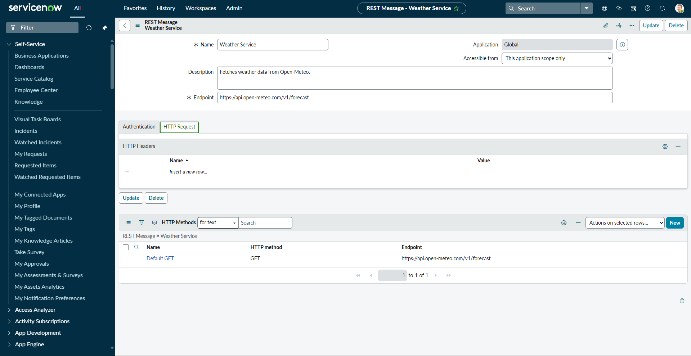
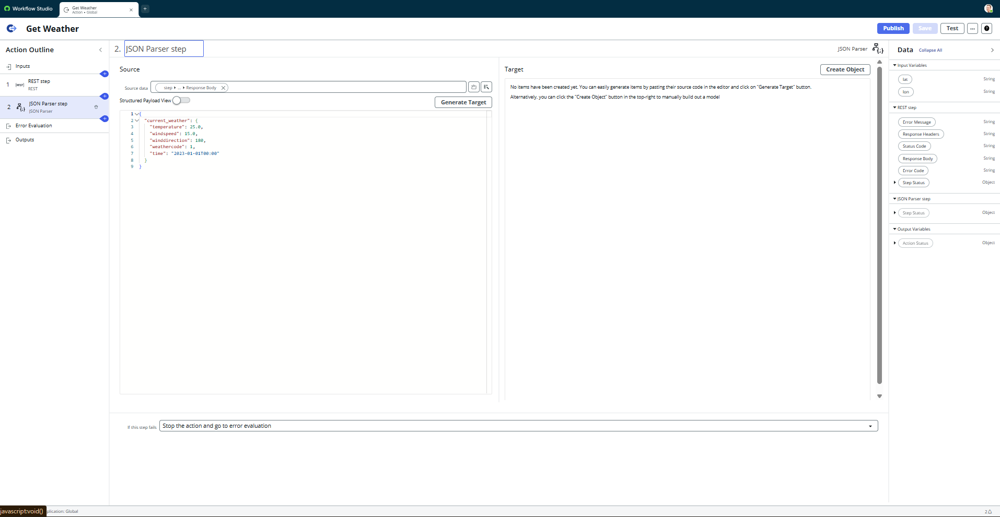
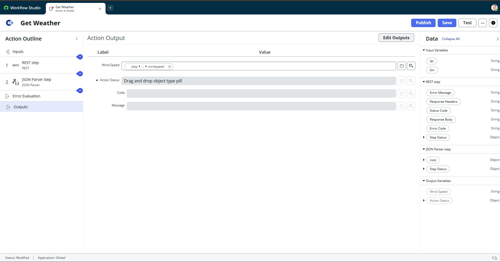
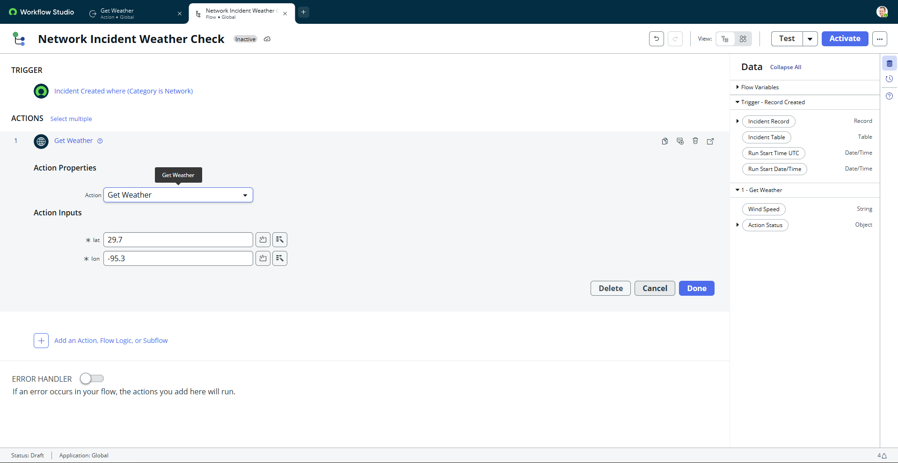
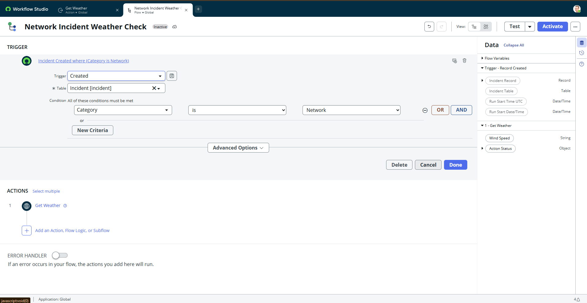
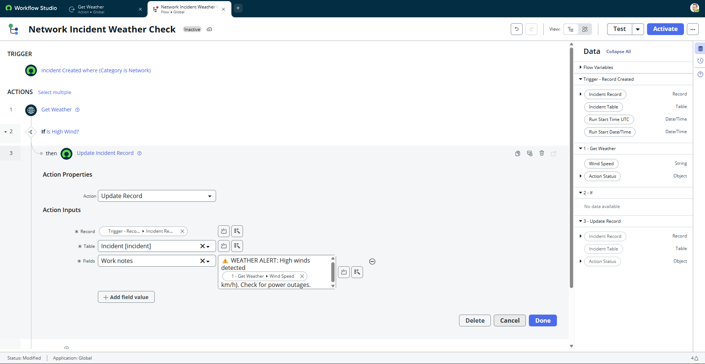
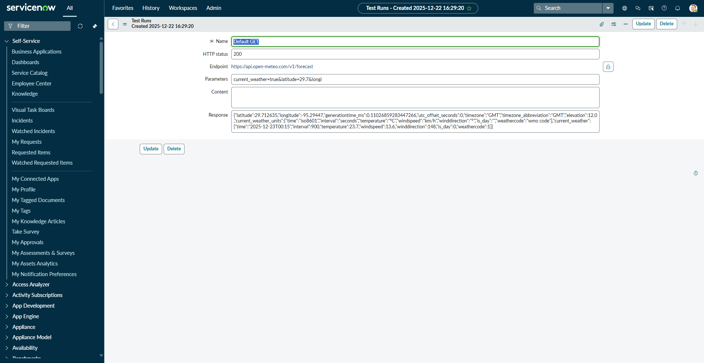
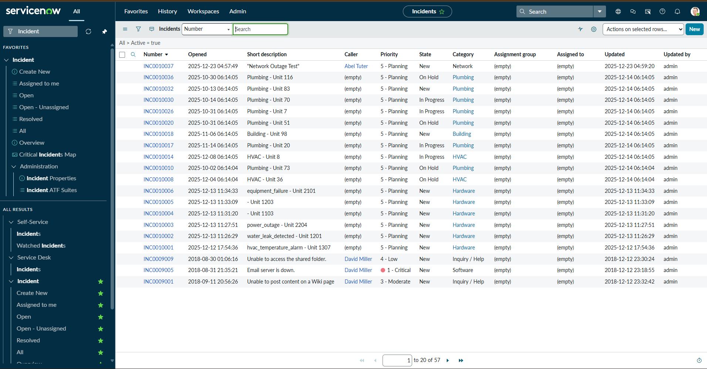
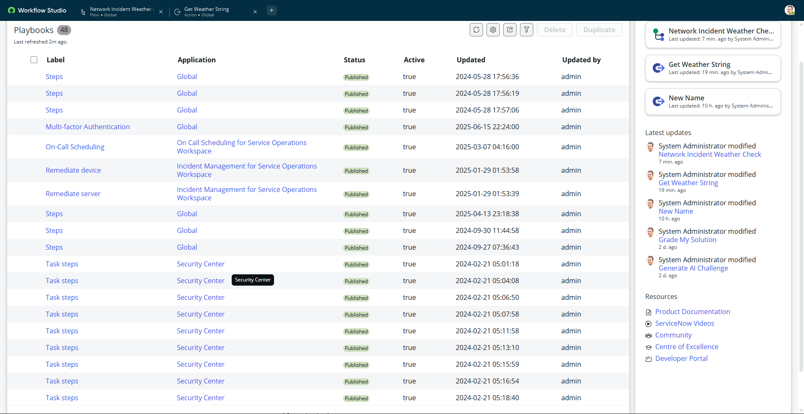
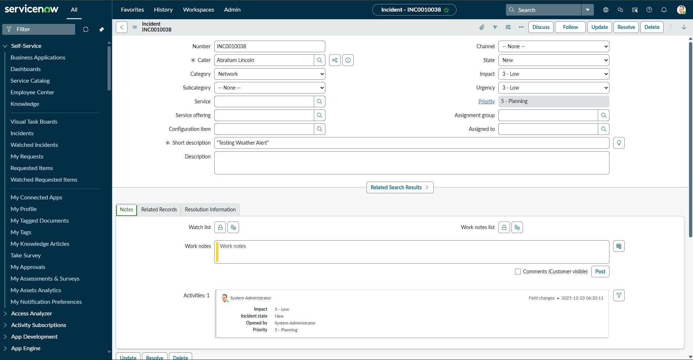

# Network Incident Weather Check Integration

Built an automated weather safety check for network incidents using ServiceNow Workflow Studio. Configured REST API integration with external weather service (Open-Meteo) to automatically flag hazardous wind conditions before technician dispatch.

**Business Value:** Prevents technician dispatch during unsafe weather, provides instant environmental context for network outages, and shows working REST API integration capability with external services.

---

## Business Problem

**Before:**
- Field technicians dispatched to network outages without weather visibility
- Safety risks from high winds at cell tower/network equipment sites
- Manual weather checks delayed response time
- No automated risk assessment for hazardous conditions
- Incidents lacked environmental context for triage prioritization

---

## Solution Delivered

**Workflow Studio Integration:**
- Built custom action ("Get Weather") in Workflow Studio for API calls
- Configured REST API connection to Open-Meteo weather service
- Set up location-based weather data retrieval using latitude/longitude inputs
- Created flow automation triggering when Network incidents are created
- Configured conditional logic checking wind speed against 10 km/h threshold
- Automated work note updates with weather alert messages

---

## Business Value

**What the System Does:**
- **Flags hazardous weather** before dispatching technicians to outage sites
- **Adds environmental context** to incident records automatically
- **Enables risk-based prioritization** of network outages
- **Shows REST API integration** with third-party weather data
- **Provides working example** of location-based external data integration

---

## Technical Highlights

**ServiceNow Features Used:**
- **Workflow Studio:** Custom action creation with REST API configuration
- **REST API Integration:** GET requests with query parameters
- **JSON Parsing:** Mapping API response data to ServiceNow fields
- **Data Type Configuration:** Set wind speed as Decimal (not String) to enable math comparisons
- **Flow Automation:** Event-triggered workflow with if/then logic
- **Record Updates:** Automated work note additions to incident records

**Integration Architecture:**

**Custom Action: "Get Weather"**
- **Inputs:** Latitude (Decimal), Longitude (Decimal)
- **REST Endpoint:** `https://api.open-meteo.com/v1/forecast`
- **Query Parameters:**
  - `latitude`: Dynamic input from incident location
  - `longitude`: Dynamic input from incident location
  - `current_weather`: `true` (boolean flag for real-time data)
- **Output:** Wind speed (explicitly typed as Decimal for mathematical comparison)

**Flow: "Network Incident Weather Check"**
- **Trigger:** Record Created on Incident table (Category = Network)
- **Actions:**
  1. Extract location coordinates from incident record
  2. Call "Get Weather" action with dynamic lat/long
  3. Evaluate conditional: Wind Speed > 10 km/h
  4. Update incident work notes if threshold exceeded

**Code Example - Action Output Configuration:**
```javascript
// Explicit data type definition enabling mathematical operators
// Output: Wind Speed (Type: Decimal)
// This allows Flow Designer to use "Greater Than" logic instead of text comparison
{
  "wind_speed": {
    "type": "decimal",
    "label": "Wind Speed (km/h)",
    "mandatory": false
  }
}
```

---

## Key Technical Challenges Solved

### Challenge 1: Data Type Mismatch
**Problem:** Flow Designer only showed "Contains" and "Is" operators, not "Greater Than"  
**Root Cause:** JSON Parser returned wind speed as String (text) by default  
**Solution:** Explicitly configured Action Output to force Decimal data type, unlocking mathematical comparison operators

### Challenge 2: Null JSON Response
**Problem:** JSON Parser crashed with "Null Transformer" error  
**Root Cause:** Missing `current_weather=true` parameter meant API didn't return expected data block  
**Solution:** Added boolean parameter to REST step to request specific data structure

### Challenge 3: API Connection Failures
**Problem:** REST endpoint returned 404 errors  
**Root Cause:** Typo in resource path (`/v1/forcast` instead of `/v1/forecast`)  
**Solution:** Corrected endpoint spelling

### Challenge 4: Coordinate Format Errors
**Problem:** API rejected location coordinates  
**Root Cause:** Longitude formatted as `95.3-` instead of `-95.3` (floating negative sign)  
**Solution:** Standardized coordinate input format (negative sign prefix)

---

## Screenshots

### REST API Configuration
  
*REST step configuration showing GET endpoint, query parameters (lat, lon, current_weather=true), and successful connection test*

### JSON Parser Data Mapping
  
*Complex JSON response mapped to ServiceNow data pills for use in Flow Designer logic*

### Action Output - Data Type Configuration
  
*Explicit Decimal type definition enabling mathematical comparison operators in conditional logic*

### Custom Action Overview
  
*Complete IntegrationHub Spoke showing inputs (lat/lon), REST step, JSON parsing, and typed outputs*

### Flow Designer Trigger Configuration
  
*Event trigger on Incident table creation with Category = Network filter*

### Flow Conditional Logic
  
*If/Then conditional evaluating wind speed > 10 km/h threshold with dynamic work note update*

### Successful Execution Log
  
*Execution log showing successful data retrieval (11.9 km/h wind speed), "Evaluated - True" status, and incident update completion*

---

## Testing & Verification

### REST API Connection Test
  
*REST step test execution showing 200 OK response status, successful connection to Open-Meteo API, and confirmation of data retrieval*

### Raw JSON Response
  
*Complete JSON payload from weather API showing current_weather object with wind_speed: 11.9, temperature, wind_direction, and weather_code fields*

### Complete Flow Execution
  
*End-to-end flow execution showing trigger activation, REST API call, conditional evaluation (True), and successful incident record update with weather alert*

**Validation Results:**
- ✅ REST endpoint connectivity verified (200 OK response)
- ✅ JSON parsing successful (wind_speed extracted as Decimal)
- ✅ Conditional logic evaluated correctly (11.9 > 10 = True)
- ✅ Incident work notes updated with dynamic alert message
- ✅ No errors in execution log
- ✅ Data type handling correct (mathematical operators functional)

---

## Setup Notes

**Environment:** ServiceNow Personal Developer Instance (Zurich Release)

**Prerequisites:**
- Workflow Studio access (included in PDI)
- Incident table
- Network category configured for Incidents

**External API:**
- **Service:** Open-Meteo (Free Weather API)
- **Endpoint:** `https://api.open-meteo.com/v1/forecast`
- **Authentication:** None required (public API)
- **Rate Limits:** Generous free tier (no API key needed for testing)

**Key Configuration Steps:**
1. Open Workflow Studio
2. Create custom action ("Get Weather")
3. Configure REST step with endpoint and parameters
4. Add JSON Parser to transform response
5. Define output variables with data types (Decimal for wind_speed)
6. Create flow ("Network Incident Weather Check")
7. Configure trigger (Record Created, Incident table, Category=Network)
8. Add "Get Weather" action with dynamic inputs
9. Add conditional logic (If Wind Speed > 10)
10. Configure incident update action

**Testing:**
- Create Network category incident with known lat/long
- Monitor execution logs for API call success
- Verify work note update with dynamic wind speed value
- Test edge cases (low wind, API failures, missing coordinates)

---

## Project Notes

**Built on ServiceNow PDI (Zurich Release)**

This project demonstrates Workflow Studio REST API integration capabilities. The safety threshold (10 km/h) is currently hardcoded in the flow logic. In a real production environment, this could be moved to a system property for easier configuration changes.

---

**Technologies:** ServiceNow (Zurich Release) Workflow Studio • REST API • JSON Parsing • Open-Meteo Weather API
